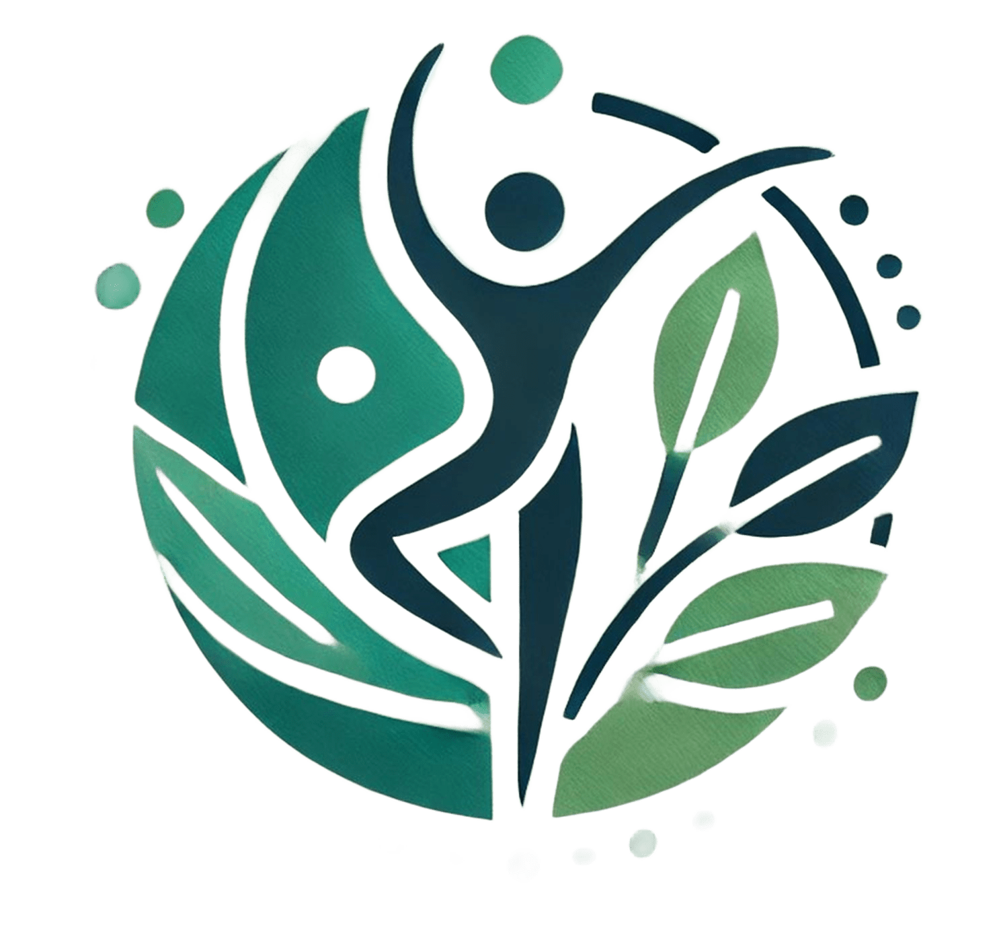
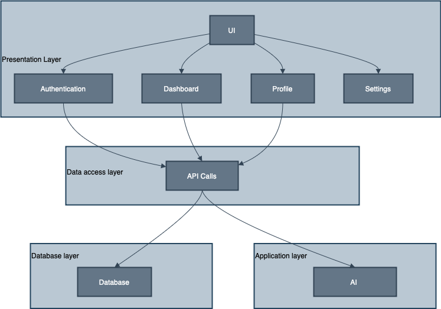
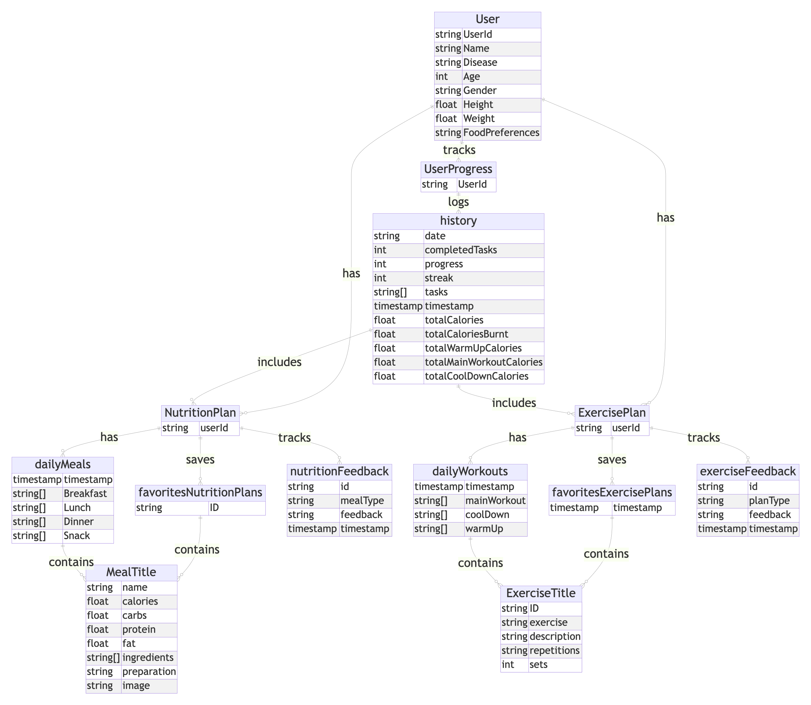
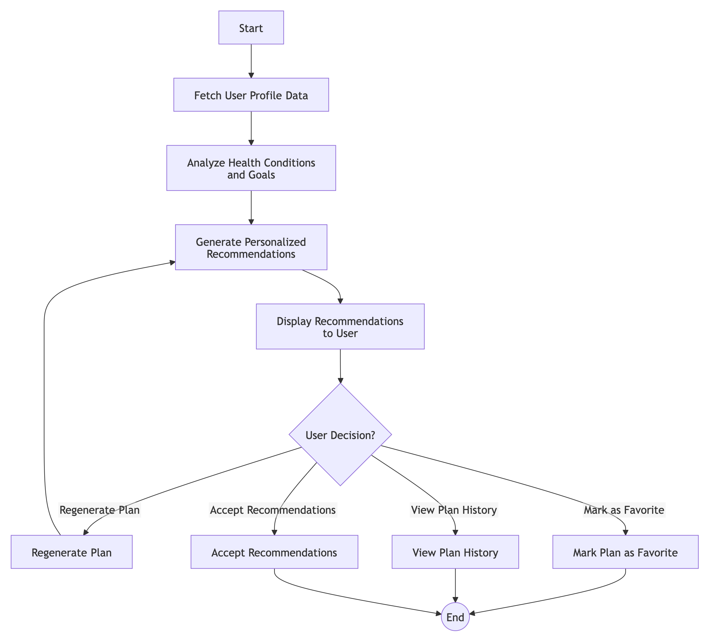

# Ettizan

  

## 📌 About Ettizan  
Ettizan is a personalized AI-powered mobile application designed to assist individuals in managing chronic diseases through customized nutrition and fitness plans. By using advanced AI, the application analyzes user-specific health data to provide tailored recommendations, ensuring a more effective and user-friendly experience.

---

## 🎥 Demo  

Watch our project demo to see **Ettizan** in action!  
🔗 **[Ettizan Demo](https://drive.google.com/file/d/1URw75cFvuwYuPpdC8lyA23Tu7zW9y0wQ/view?usp=sharing)**  

This demo provides an overview of the **app's features, functionality, and user experience**, showcasing how **AI-powered personalized health plans** assist individuals with chronic diseases.  

---
## 🎯 Key Features  
- **Personalized Nutrition Plans** – AI-generated meal recommendations based on health conditions and dietary preferences.  
- **Custom Exercise Plans** – Exercise routines designed to fit users' health goals and fitness levels.  
- **Progress Tracking** – Monitor Daily progress.  
- **User-Friendly Interface** – Built with Flutter for seamless navigation.  
- **Secure Data Management** – Firebase integration ensures secure and efficient storage.  
 

## 🛠️ Technologies Used  
- **Frontend:** Flutter  
- **Backend & Database:** Firebase  
- **AI:** Gemini

## 🏗️ System Architecture

The system follows a layered architecture with the following components:

### 1. **Presentation Layer (Client)**
- Mobile app (iOS/Android) with screens for Home, Meal Plans, Exercise Plans, History, Favorites, Profile, and Feedback.
- Communicates with the Application Layer via the Gemini API.

### 2. **Application Layer (Server)**
- Core processing layer with:
  - **AI Engine**: Generates personalized recommendations.
  - **Goal Tracker**: Monitors progress.
  - **Feedback Handler**: Collects user feedback.

### 3. **Data Access Layer**
- Manages communication between the Application Layer and the Database.
- Includes API Gateway and Query Handlers for data retrieval and updates.

### 4. **Database Layer**
- Stores user data securely, including user profiles, recommendations, favorites, and feedback.

  


## 🗂️ Entity-Relationship Diagram

The **ER Diagram** visually represents the relationships between the main entities in the Ettizan app. Each entity corresponds to a collection in the database, ensuring efficient data management.

#### Entities:
- **User**: Stores personal and health data.
- **UserProgress**: Tracks user progress over time.
- **NutritionPlan**: Personalized meal plans.
- **ExercisePlan**: Custom exercise routines.
- **MealTitle**: Details of meals in a nutrition plan.
- **ExerciseTitle**: Details of exercises in a workout plan.
- **History**: Logs daily user activities and progress.
- **Favorites**: Stores favorite plans for easy access.

#### Relationships:
- **User → UserProgress**: Tracks user health metrics.
- **User → NutritionPlan/ExercisePlan**: Personalized plans for each user.
- **NutritionPlan → MealTitle**: Daily meal records.
- **ExercisePlan → ExerciseTitle**: Daily workout routines.
- **User → Favorites**: Saves favorite plans.
- **User → History**: Logs daily tasks and progress.

This diagram illustrates how the app manages and uses user data for personalized recommendations.
  


## Activity Diagram: Requesting a Plan (Meal and Exercise Plan)

The activity diagram outlines the steps a user follows when requesting a personalized meal and exercise plan:

1. **User Input**: The user enters personal information (e.g., health data, preferences).
2. **Request Submission**: The user submits the request for a plan.
3. **Input Verification**: The system verifies the entered data for accuracy and completeness.
   - **Decision Point**: If invalid data, the system prompts the user to correct it.
4. **Plan Generation**: The system uses AI (Gemini) to generate a personalized meal and exercise plan.
5. **Presentation**: The generated plan is displayed to the user.

The flow also includes decision points for input validation and system responses, ensuring smooth interaction from start to finish.

  


## 🏗️ Project Setup  

### Prerequisites  
- Install Flutter SDK ([Download Flutter](https://flutter.dev/docs/get-started/install))  
- Set up a Firebase project ([Firebase Console](https://console.firebase.google.com/))  
- Python environment for AI models  

### Installation Steps  
1. **Clone the repository:**  
   ```bash
   git clone https://github.com/your-repo/ettizan.git
   cd ettizan
2. **Install dependencies:**  
   ```bash
   flutter pub get
   ```
3. **Set up Firebase:**  
   - Create a Firebase project and enable Firestore & Authentication.  
   - Add `google-services.json` (Android) and `GoogleService-Info.plist` (iOS).  

4. **Run the application:**  
   ```bash
   flutter run
   ```

## 📌 Why Ettizan?  

### 🩺 Addressing the Gap in Health Applications  
Most existing health and fitness apps provide generic solutions that do not cater to the specific needs of individuals with chronic diseases. Ettizan bridges this gap by offering tailored plans based on a comprehensive analysis of user health data.

### 🔹 Enhancing User Experience  
- Simplifies health management through AI-powered automation.  
- Ensures accessibility and usability with a clean UI.  
- Encourages adherence to health plans with reminders and personalized recommendations.  

## 📈 Future Enhancements  
- **Community Features:** Enable peer support and expert consultations.  
- **Integration with Wearables:** Support data sync from smartwatches and fitness trackers.  

## 📸 App Screenshots
 


## 📬 Contact  
For inquiries or contributions, contact us at **Ettizanapp@gmail.com**.  

## 👩‍💻 Development Team  
- **Aroub Yousef Alomayrini**
- **Layan Abdulaziz Almanaa**
- **Leena Dakhil Allah Algashami**  
- **Ohoud Ali Kaabi**


##  Supervisor
- Dr. Raad Alturki


   
